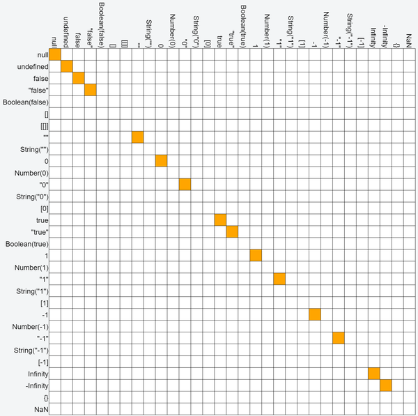
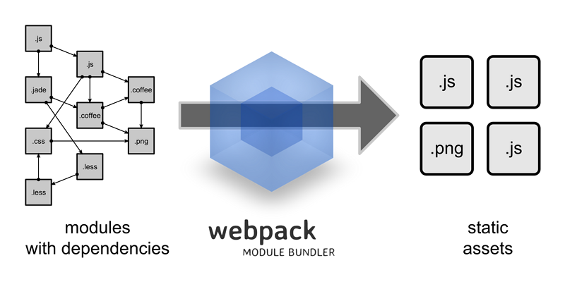

## 1.温故知新

### 1.2 javascript

#### 1.2.1 数据类型

##### js的六种数据类型
在js中定义变量的时候无需指定类型，比如定义一个变量

```
    var a = 18;
```

稍后马上赋值一个字符串,也是可以的

```
    a = "my is string";
```

所以会有很多人会觉得js好简单，定义变量的时候连类型是什么都不用管。那么是这样的吗？带着这个疑问我们来看一看下面这些问题。

```
    18 + 18
```

36，是做一个加法的运算，那么稍微做一点修改

```
    "18" + 18
```

1818,这次会理解为字符串拼接

```
    "18" - 18
```

0,这次会理解为数字运算

那么我们可以看到javascript虽然不需要指定类型，但是就是因为没有显示的指定类型，反而在一些操作符等等一系列运算的时候，背后有很多的隐式转换，反而让人摸不清头脑。

那么我们先来看一看javascript有哪些数据类型，我们把一些常见的比较基础简单的类型叫做

### 原始类型

number string boolean null undefined

null和undefined是比较特殊的原始类型

### 对象类型

object

Function Array Date

#### 1.2.2 隐式转换

```
    var x = 'xxxxxxxxxx' + 42;
    "18" - 7    // 11
    "18" + 7    // 187
```

巧用+/-规则转换类型

```
num - 0;    //转成数字类型
num + "";   //转成字符串类型
```

实际上刚才只是常见加号减号运算，javascript的运算符还有很多，还有常见的“等于”和“严格等于”

我们可以看到

```
"1.23" == 1.23 //当等号一边是字符串一边是数字的时候，会尝试把字符串转换成数字，再进行比较
0 == false
null == undefined
new Object() == new Object()
[1,2] == [1,2]
```

我们先来看一下严格等于

```
    a === b
    //严格等于 
    1.判断等号两边的类型，类型不同返回false
    2.类型相同：
    大部分情况大家都知道，比如说1.2 === 1.2 ，"aaaaa" === "aaaaa"
    null === null
    undefined === undefined
    new Object() == new Object()
    NaN ≠ NaN
    new Object ≠ new Object
```

对于“等于”可能会复杂一点

```
1.类型相同，同===

2.类型不同，尝试类型转换和比较：

null == undefined 相等

number == string 转number    1 == "1.0"//true

boolean == ? 转number    1 == true//true

object == number|string 尝试对象转为基本类型  new String("hi") == "hi" //true

3.其它：false
```

### 参考图

这是 ==


这是 ===



## 2.新思考

### 2.1.前端路由如何实现？

```
function Router() {
    this.routes = {};
    this.currentUrl = '';
}
Router.prototype.route = function(path, callback) {
    this.routes[path] = callback || function(){};
};
Router.prototype.refresh = function() {
    this.currentUrl = location.hash.slice(1) || '/';
    this.routes[this.currentUrl]();
};
Router.prototype.init = function() {
    window.addEventListener('load', this.refresh.bind(this), false);
    window.addEventListener('hashchange', this.refresh.bind(this), false);
}
Router = new Router();
Router.init();
```

html

```
<ul> 
    <li><a href="#/">turn white</a></li> 
    <li><a href="#/blue">turn blue</a></li> 
    <li><a href="#/green">turn green</a></li> 
</ul>
```

调用

```
var content = document.querySelector('body');
// change Page anything
function changeBgColor(color) {
    content.style.backgroundColor = color;
}
Router.route('/', function() {
    changeBgColor('white');
});
Router.route('/blue', function() {
    changeBgColor('blue');
});
Router.route('/green', function() {
    changeBgColor('green');
});
```

1.init 监听浏览器 url hash 更新事件
2.route 存储路由更新时的回调到回调数组routes中，回调函数将负责对页面的更新
3.refresh 执行当前url对应的回调函数，更新页面

## 2.前端的那些事

### 2.1 前端自动化构建工具




#### gulp的基本使用
```
var gulp = require("gulp");     //本地安装gulp所用到的地方
var autoprefixer = require("gulp-autoprefixer");    //自动处理浏览器前缀
var less = require("gulp-less");
var clean = require("gulp-clean");
var paths = {
    src_html:               "src/**/*.html",
    src_less:               "src/**/*.less",
    dist_url:               "dist",
    dist_css:               "dist/css",
};
gulp.task("style", function() {
    gulp.src([paths.src_less])
    .pipe(less())
    .pipe(autoprefixer('> 1%', 'IE 8'))
    .pipe(gulp.dest(paths.dist_url));
});
gulp.task("html", function() {
    gulp.src([paths.src_html])
    .pipe(gulp.dest(paths.dist_url));
});
gulp.task("default", ["clean"], function() {
    gulp.start(['html', 'style']);
});
gulp.task("clean", function() {
    return gulp.src([
        paths.dist_url
    ], {read: false})
    .pipe(clean());
});
gulp.task("watch", function() {
    gulp.watch([paths.src_less], ['style']);
});
```
### 2.2 现行主流前端框架讨论


